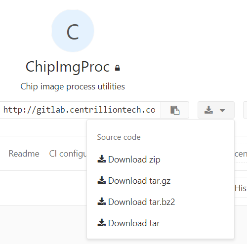

# Getting start {#mainpage}

## Build ChipImgProc from source by CMake on Windows MinGW

### Requirement

* Your project must be a CMake project
* GCC >= 7.3 (7.3 is recommended and well tested)
* CMake >= 3.13
* MSVC <= v141 build tool

### Steps

```bat
:: Download submodules (ChipImgProcTestData)
ChipImgProc\> git submodule init
ChipImgProc\> git submodule update

:: Prepare build
ChipImgProc\> mkdir build
ChipImgProc\> cd build

:: Configure build, will build all upstream dependencies
build\> cmake .. -G "MinGW Makefiles" -DCMAKE_INSTALL_PREFIX="..\stage" -DINSTALL_DEPS=ON -DCMAKE_BUILD_TYPE="Release" -DCOPY_ALL_TP=ON

:: Build project, and install
build\> cmake --build . --target install

:: Now the result will put in ChipImgProc\stage
:: All upstream library will put in ChipImgProc\stage\third_party
```

### About Gitlab download icon link



We assume the users visit the download icon link or the release tags just want to use the library but run the unit test, which means the users download project in such way should use an the alternative configure command:

```bat
build\> cmake .. -G "MinGW Makefiles" -DCMAKE_INSTALL_PREFIX="..\stage" -DINSTALL_DEPS=ON -DCMAKE_BUILD_TYPE="Release" -DCOPY_ALL_TP=ON -DBUILD_TESTS=OFF
```

In this case, Build script will not need test data and of course, no test code will be built.
Only library source will be compiled into binary.

## Manually link ChipImgProc

C++ Flags (assuming use g++ compiler)

* -std=c++17

Include directory:

* ChipImgProc\stage\include
* ChipImgProc\stage\third_party\include
* ChipImgProc\stage\third_party\include\opencv

Link directory:

* ChipImgProc\stage\lib
* ChipImgProc\stage\third_party\lib
* ChipImgProc\stage\third_party\x64\mingw\staticlib

Link libraries:

* ChipImgProc
  * libChipImgProc-logger
  * libChipImgProc-utils
  * libcpp_base64-base64
* Nucleona
  * libNucleona
  * libNucleona-sys-executable_dir
  * libNucleona-stream-null_buffer
  * libNucleona-parallel-thread_pool
  * libNucleona-util
* OpenCV
  * libopencv_ml340
  * libopencv_objdetect340
  * libopencv_shape340
  * libopencv_stitching340
  * libopencv_superres340
  * libopencv_videostab340
  * libopencv_calib3d340
  * libopencv_features2d340
  * libopencv_flann340
  * libopencv_highgui340
  * libopencv_photo340
  * libopencv_video340
  * libopencv_videoio340
  * libopencv_imgcodecs340
  * libopencv_imgproc340
  * libopencv_core340
* OpenCV upstream dependent
  * liblibjasper
  * libjpeg
  * liblibwebp
  * libpng
  * liblibtiff
* Boost
  * libboost_filesystem-mt-X64
  * more boost library goes here...
* Win32 and other utility library
  * libzlib
  * comctl32
  * gdi32
  * setupapi
  * ws2_32
  * m
  * avifil32
  * avicap32
  * winmm
  * msvfw32
  * kernel32
  * user32
  * gdi32
  * winspool
  * shell32
  * ole32
  * oleaut32
  * uuid
  * comdlg32
  * advapi32

### Trouble shooting

* Missing link library

  The library link is highly depend on user code, your code may require alternative link order or use more library beyond the following list.
  We put all dependencies in the \<*ChipImgProc install prefix*>/lib and \<*ChipImgProc install prefix*>/third_party.
  You should be able to find any missing library and add to your link command.

Manually include and link OpenCV & Boost are really painful, so we suggest to use CMake & Hunter to do such link works.

## Import ChipImgProc by Hunter

To use the Hunter package manager, all upstream will be built, 
user no need to build ChipImgProc manually.

### Requirement


* Your project must be a CMake project
* GCC >= 7.3 (7.3 is recommended and well tested)
* CMake >= 3.13
* MSVC <= v141 build tool

### Hunter configuration

1. Download Hunter Gate from [our Gitlab](http://gitlab.centrilliontech.com.tw:10080/centrillion/gate/blob/URL-git-commit/cmake/HunterGate.cmake).
2. Put HunterGate.cmake to *\<your_project\>*/cmake/ directory.
3. Create and add following code to *\<your_project\>*/cmake/packages.cmake

        if( MINGW )
            set(OpenCV_ENABLE_PRECOMPILED_HEADERS OFF)
        else()
            set(OpenCV_ENABLE_PRECOMPILED_HEADERS ON)
        endif()
        hunter_config(
            OpenCV
            VERSION "3.4.0-p0"
            CMAKE_ARGS
                BUILD_SHARED_LIBS=OFF
                ENABLE_PRECOMPILED_HEADERS=${OpenCV_ENABLE_PRECOMPILED_HEADERS}
        )
        hunter_config(
            OpenCV-Extra
            VERSION "3.4.0"
        )

4. Add following code into CMakeLists.txt and place before ```project(...)```.

        include(cmake/HunterGate.cmake)
        HunterGate(
            URL "http://gitlab.centrilliontech.com.tw:10080/centrillion/hunter.git"
            SHA1 7534d27dc7d7c18381f995a4ef48140d1e6279ed
            FILEPATH ${CMAKE_CURRENT_LIST_DIR}/cmake/packages.cmake
        )

5. Add following code after ```project(...)```.

        hunter_add_package(ChipImgProc)
        find_package(ChipImgProc CONFIG REQUIRED)

### A full example

cmake/packages.cmake

```cmake
if( MINGW )
    set(OpenCV_ENABLE_PRECOMPILED_HEADERS OFF)
else()
    set(OpenCV_ENABLE_PRECOMPILED_HEADERS ON)
endif()
hunter_config(
    OpenCV
    VERSION "3.4.0-p0"
    CMAKE_ARGS
        BUILD_SHARED_LIBS=OFF
        ENABLE_PRECOMPILED_HEADERS=${OpenCV_ENABLE_PRECOMPILED_HEADERS}
)
hunter_config(
    OpenCV-Extra
    VERSION "3.4.0"
)
```

CMakeLists.txt

```cmake
cmake_minimum_required(VERSION 3.13.0)
include(cmake/HunterGate.cmake)
HunterGate(
    URL "http://gitlab.centrilliontech.com.tw:10080/centrillion/hunter.git"
    SHA1 7534d27dc7d7c18381f995a4ef48140d1e6279ed
    FILEPATH ${CMAKE_CURRENT_LIST_DIR}/cmake/packages.cmake
)
project(ChipImgProc-example)

hunter_add_package(ChipImgProc)
find_package(ChipImgProc CONFIG REQUIRED)
add_executable(foo foo.cpp)
target_link_libraries(foo PUBLIC ChipImgProc::ChipImgProc)
```

## Feature Introduction

To extract the probe intensities from the image. 
There are several issues of the image we need to resolve:

1. The images are slanted
2. Noise
3. Grid recognition and segmentation
4. A chip sample is captured into multiple images, which need to be stitched.
5. The region of interest detection, remove the regions we don't need.
etc.

To solve these issues, we develop a pipeline with following steps:

* @subpage improc_image_rotation
* @subpage improc_gridding
* @subpage improc_min_cv_auto_margin
* @subpage improc_background_fix_sub_and_division01
* @subpage improc_stitiching
